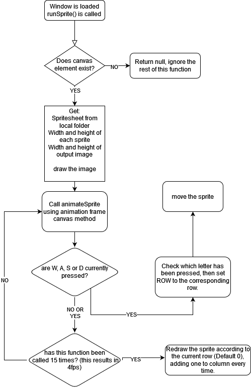
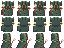

# ☑ 1.4.3

To meet this section of the success criteria, an algorithm that:

* Gets an image (the spritesheet)
* Splits the spritesheet into animation-frames
* Displays the individual animation-frame on the canvas
* Updates _position_ everytime the HTML canvas updates (60fps)
* Updates the animation-frame whenever the update has been called 15 times OR when the direction has been changed.

must be devised.

<figure><figcaption><p>The main sprite display loop.</p></figcaption></figure>

<figure><figcaption><p>A spritesheet</p></figcaption></figure>

Above you can see an example of a spritesheet; a (3\*16) by (4\*16)px image, with individual sprite frames 16x16px. The three rows illustrate Up, Down, and Right respectively. The columns are the following frames that will be used to make the sprite look as though it is moving in the direction pressed.

```javascript
var row = 0;
var column = 0;
```

Would be the needed variables, indicated within the flowchart. They are integers; `column` would need to be incremented every fifteen loops, and `row` _only_ when any of the arrow keys have been pressed.&#x20;

It is worth noting, I have chosen to forgo a fourth row on the actual spritesheet- however the variable would be expected to handle 0 (down/default), 1(up), 2(right), and 3- left. Left will be created by flipping the images, remaining on the same row of the image as 2. This would be done using a switch-case statement, and the code within will handle the actual drawing of the image.

#### TEST CASES:

For this to be considered a "completed" part of the success criterea, it must pass the following:

* [ ] Display the sprite within the canvas. <mark style="color:blue;background-color:blue;">No input data</mark>. <mark style="color:orange;">Output is Visual</mark>.
* [ ] Move when the arrow keys are pressed:
  * [ ] If <mark style="color:blue;background-color:blue;">up is pressed</mark>, the <mark style="color:orange;">sprite moves up</mark> at an appropriate speed.
  * [ ] If <mark style="color:blue;background-color:blue;">down is pressed</mark>, the <mark style="color:orange;">sprite moves down</mark> at an appropriate speed.
  * [ ] If <mark style="color:blue;background-color:blue;">left is pressed</mark>, the <mark style="color:orange;">sprite moves left</mark> at an appropriate speed.
  * [ ] If <mark style="color:blue;background-color:blue;">right is pressed</mark>, the <mark style="color:orange;">sprite moves right</mark> at an approptiate speed.
  * [ ] If <mark style="color:blue;background-color:blue;">Left+Up, Right+Up, Right+Down or Left+Down are pressed at the same time</mark>, the <mark style="color:orange;">sprite should move in the correct diagonal</mark>. **`!NOTE:`**` ``The speed on diagonals should have a lower multiplier, to prevent the movement speed stacking.`
  * [ ] If <mark style="color:blue;background-color:blue;">two conflicting directions are pressed</mark>, the <mark style="color:orange;">sprite should not move</mark>.&#x20;
* [ ] When any of the <mark style="color:blue;background-color:blue;">directions are pressed</mark>, the respective <mark style="color:orange;">row on the sprite sheet is displayed</mark>.
* [ ] Every fifteen loops, the sprites frame will update along the column. <mark style="color:blue;background-color:blue;">No input data.</mark> <mark style="color:orange;">Output is Visual.</mark>
* [ ] <mark style="color:green;">EXTENSION:</mark> The Sprite should not be able to cross the boundary of the canvas display. I<mark style="color:blue;background-color:blue;">nput being the sprite colliding with the edge of the displayed canvas,</mark> <mark style="color:orange;">output being that the sprite ceases to move in that direction.</mark>

