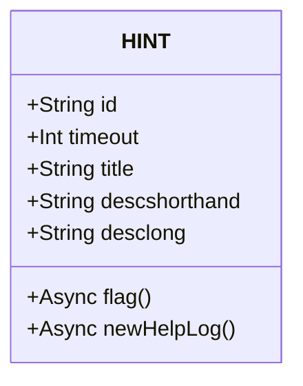

# Progression system

The goals of this is to implement:

* The loading of stages from a specific file.
* The record of progression.&#x20;
* The "unlocking" of hints as progression is made.

For this part of the project, OOP will need to be utilised, as these segments of the game are going to need templates to be reused with different values.&#x20;

The two classes here would be `STAGE`, and `HINT`. They would need several methods and values to be passed in. There is also a possibility to use JSON files here to use as storage for the objects for these classes, but I will not say confidently that I will implement that as I have never used JSON files as of writing this, and while I know that they are used to store objects, I am not sure how I would parse the data yet.

### HINT



Above is the simple class diagram for `HINT.`

This class is for the template of&#x20;

* Displaying a hint of title `title` and description `descshorthand`, for `timeout` number of milliseconds, then calling **`newHelpLog()`**.
* Creating an element with id `id` with title `title` and content of `desclonghand.`

No values will need to be passed in as they will be used locally within every instance of the object, using the `this.` feature that defines data to only be access within an object. None of the information will be needed to converse with other classes here.

#### flag()

**`flag()`** is the method that addreses the first bullet. The final output of the following object will look like the image below.


```javascript
const hintColor = new HINT('htColor', 3500, 'COLOR', 'Color sets the colour of the text, using color:[colourName¦hexCode¦RGB];', "<e>Color</e> is a property that defines the colour of the text. Unfortunately, using the american spelling of it.<br>The way you use this property is:<br><syntax>color:[colourName¦hexCode¦RGBa];</syntax><br><e>colourName</e> is a word for a colour. These names are already defined- you can find a full list <a href='https://htmlcolorcodes.com/color-names/'>here.</a><br><e>hexCodes</e> are a special code which look like <e>#</e>abcdef. <a href='https://www.hexcolortool.com/'>Here</a> is a colour picker that generates a hex code. You may see it also generates a <e>RGBa</e> code, which works similarly.<br>RGBa are written as <e>rgba(number,number,number,0 to 1)</e>, where all numbers are between 0 and 255. <e>a</> is Alpha, which is another name for<e> opacity</e>.")

```


<figure><figcaption></figcaption></figure>

This will be displayed using one group of html elements, who's stylings are already set. It should be not visible until flag is called. To do so, I could simply set this to be someplace far off the screen, with overflow of the body off, so it does not scroll. When **`flag()`** is called, a class can be added which moves the elements into the visible window, and the title and subtitle can be updated with the object values.&#x20;


```python
#the pseudocode 

async method flag():
    hintWrapper.classlist.remove("hidden") #this would remove display:none
    hintTitle.innerHTML = title
    hintText.innerHTML = descshorthand
    hintWrapper.classlist.add("active")
    
    setTimeout( => {
      hintWrapper.classList.remove('active')
      hintWrapper.classList.add('hidden')

      newHelpLog()
    },timeout)
```


#### newHelpLog()

