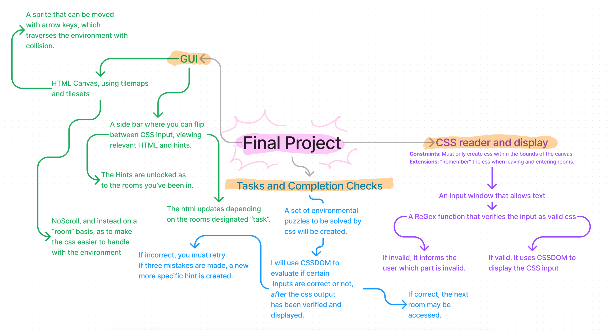

# Interface Design

Inititally on designing the interface, I wanted to go for an old style dungeon crawler-esque look to it. Idesigned a few layouts, thinking to have a RPG text box at the bottom to display instructions, an input box, and a few buttons to use. It was also somewhat inspired by bitburner.

<figure><figcaption>
The initial GUI mockup.
</figcaption></figure>

<figure><figcaption>
Screenshot of the steam game "BitBurner"
</figcaption></figure>

However, after showing the stakeholders this design concept, many of them reported that it was too "hard to look at", and that the dark colours and monochrome made it incredibly hard to read. One of them suggested that instead of an RPG text box, speech bubbles or hints should be used, as the RPG box may leave empty space when its not relevant to solving a problem. On discussing this suggestion with the rest of the stakeholders, the majority ( 4/5 ) agreed.&#x20;

The first thing that I moved onto was establishing a colour pallette. The two below were shown, but the latter was selected.

<figure><figcaption>
The unused potential pallette
</figcaption></figure>

<figure><figcaption>
The new colour pallette. It has been chosen for aesthetics, as well as being muted and easy on the eyes, in case people are looking at the interface for extended amounts of time. It also prevents people from being too distracted by the colours.
</figcaption></figure>

Another thing that was brought up, was that the interface was not obvious enough. It was hard to tell what you had to do, and the progression system would have had to been almost holding the users hand just to get a hand of it.

The first thing that was redesigned was the base layout.

Instead of all the different areas for different things, it was cut to two main visual parts: The canvas- Centered, and the biggest area by far- and the Side Tab, which partially covers the canvas. The Side tab will have buttons to toggle what the currect focus is- Whether the user wants to view the HTML, to write CSS, or check the help and hint log.

<figure><figcaption>
very bad doodle illustrating such
</figcaption></figure>

<figure><figcaption>
the final layout
</figcaption></figure>

<figure><figcaption></figcaption></figure>

This is how the new layout and pallette translates.

This design was updated in accordance to feedback repeatedly through development.
